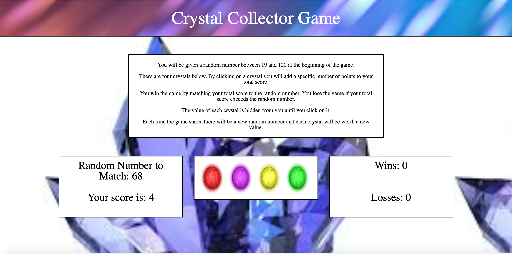
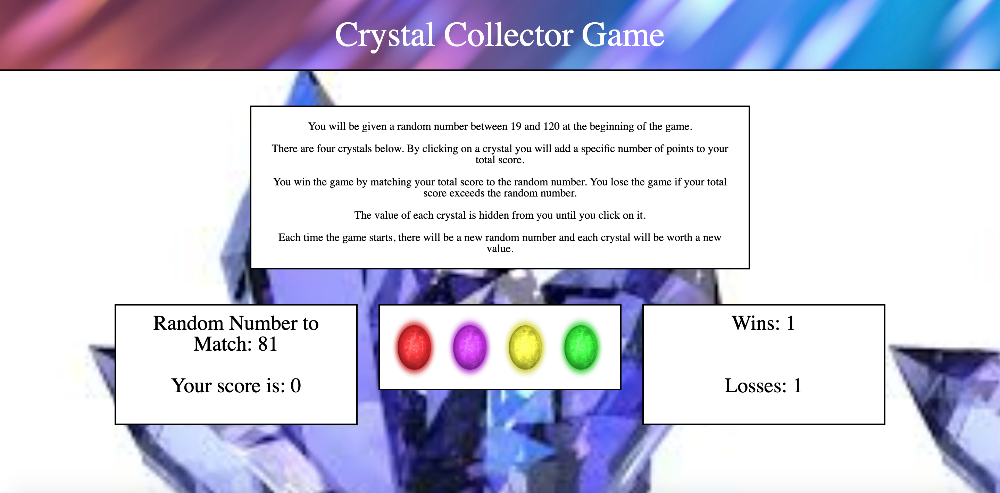

# Crystal-Collector-Game

A game for those who enjoy number games! Collect crystals whose values are initially hidden to match a randomly generated master number. This game was made using HTML, CSS, JavaScript, and jQuery.

Visit the project at https://lynnamsbury.github.io/Crystal-Collector-Game/

## Specs

The player will be shown a random number between 19 and 120 at the beginning of the game.

There will be four crystals displayed as buttons on the page.

Each crystal will have a random hidden value between 1 and 12. When the player clicks on a crystal, it will add a specific amount of points to the player's total score.

The game will hide the amount each crystal is worth until the player clicks on the crystal.

When the player does click a crystal, the player's score counter will update with the number of points that the crystal is worth.

The player wins if their total score matches the random number shown at the beginning of the game.

The player loses if their score goes above the random number shown at the beginning of the game.

The game restarts whenever the player wins or loses. When the game begins again, the player should see a new random number.

Also, all the crystals will have four new hidden values. The user's score and the score counter will reset to zero.

The app shows the total number of games that the player has won and lost.